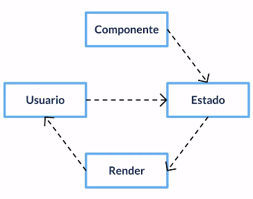
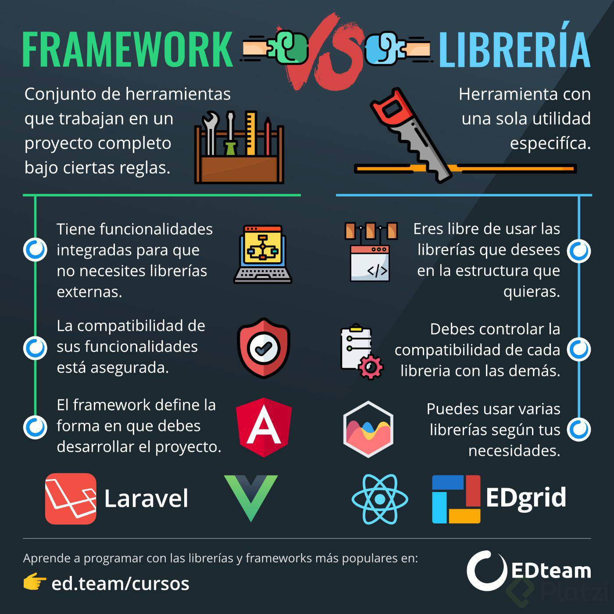
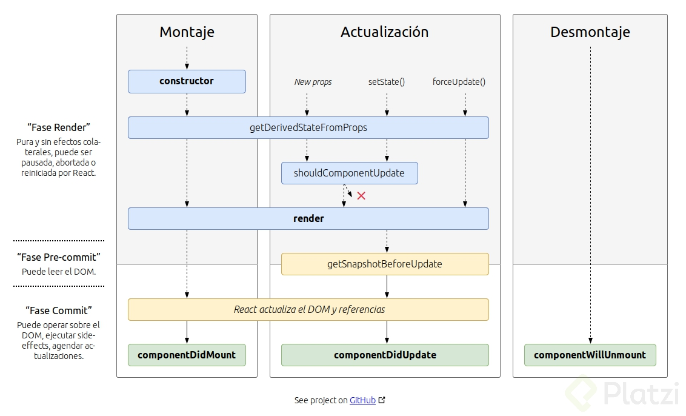

# Curso de Frameworks y librerias de JavaScript

## Websites (Sitios Web)

Son estáticos (iguales para todos los usuarios), y se pueden hacer únicamente con HTML y CSS.

## Webapps (Aplicaciones Web)

Son dinámicas (interactivas con los usuarios) y para estas se necesita JS aparte de HTML y CSS, y algún framework para facilitar el desarrollo.

## Framework (Entorno/Marco de trabajo​)

Contiene librerías y herramientas que nos ayudarán a construir algo más rápido, garantizando la calidad gracias a una metodología y estructura de trabajo bien definida.

## Librería

Es un fragmento de código que nos ayuda a resolver un problema específico y que tiene un propósito concreto.

## Qué son los componentes

En JS muchas cosas se tenían que escribir de manera diferente para cada navegador hasta que llegó JQuery a solucionar estos problemas ya que permite escribir un mismo código de JS y JQuery hace la traducción para los demás navegadores. Hoy ya no necesitamos de JQuery, solo JS.  

Hoy día JS es tan bueno que empieza a reemplazar a HTML, cada vez se escribe menos html y más JS, pero aún así no lo va a reemplazar ya que todo lo que maquetemos en JS se convierte en HTML, la diferencia es que cada vez lo hacemos menos en HTML y más en JS.  

Al escribir más en JS, nos damos cuenta que podemos reusar partes completas de una página en otras. Es un concepto parecido a las funciones. Nos da la ventaja de usar condicionales, ciclos y todas las ventajas que nos puede brindar un lenguaje de programación.  

Pensemos en los componentes como bloques de Lego, cada uno es un elemento, y al tener muchos podemos apilarlos hasta armar una app por completo, además de que nos brinda la oportunidad de cambiarlos dependiendo de lo que necesitemos. Un componente solo no nos sirve de mucho, tenemos que unirlos de alguna manera, aquí entra un concepto llamado “composición de componentes” porque podemos crear componentes usando otros componentes, como los formularios que son componentes que dentro tienen más componentes.  

## Cómo estructurar un componente

Podemos identificar componentes que tienen un mismo objetivo, entonces podemos hacer composición de componentes, en el caso del ejemplo visto en clase sería:

* **Logo:** Esta construido por el logo de Platzi y el banner del logo (el que nos avisa si hay un live).
* **Navbar:** cada enlace es su propio componente y además juntos forman el navbar.
* **Componente de autenticación:** Engloba a los botones de iniciar plan e inicio de sesión.
* **Componente de búsqueda:** Compuesto por un input y un botón diseñados especialmente para estar juntos.

Hechos estos componentes podemos llegar a lo que es el menú que es otro componente que está formado por el conjunto de todo el resto de componentes que acabamos de ver. Menú cambia, es diferente dependiendo del usuario, si es nuevo le mostramos los botones de login o suscripciones, pero si ya es un estudiante entonces debemos mostrarle los puntos, notificaciones y todo lo demás.  

Al igual que con el menú los componentes internos puedan variar dependiendo de lo que necesitemos, para esto nos ayuda tratarlos como funciones a las cuales les pediremos lo que necesitamos en especial.  

Podemos darle atributos a un componente usando otros componentes.

> NOTA: Si se tienen muchos tipos de un solo componente es señal de desorden, hay que estandarizar las cantidades de componentes.

## Reactividad

Es un paradigma, una forma de pensar nuestras aplicaciociones. Deben seguir 2 reglas:

1. Responsive, es decir, deben ser resilientes (siempre sabe qué hacer)
2. Escalables (no importa con cuánta información debemos trabajar o cuántos usuarios entran a la aplicación, la aplicación debe poder seguir funcionando sin problemas).

### Message Driven (Arquitectura basada en mensajes)

Deben de haber emisores y receptores de mensajes. Los mensajes se entregan de manera asíncrona.

> NOTA: La arquitectura no es ajena a la programación.

* Estado: Es el lugar donde vamos a guardar la información reactiva de nuestros componentes. Son variables a las que nos suscribimos para recibir una notificación cada vez que cambian sus valores.
* Render: o renderizado, es el proceso por el cual nuestro HTML, pasan a ser información visual en el DOM.
* Estrategias de render: Virtual DOM y No Virtual DOM. Ninguna es mejor, depende del caso en particular.

## Libreria vs. Framework

### Libreria

Es un conjunto de piezas de código y herramientas para un fin en específico. Un ejemplo de esto sería una caja de destornilladores con diferentes tamaños y puntas.

### Framework

Es un grupo mayor de librerías y herramientas para construir proyectos más complejos de forma efectiva. Ejemplo: una sala de herramientas con todo lo necesario para construir tu casa.

## Ecosistema de frameworks y librerias Javascript

Existen empaquetadores que nos ayudan a tener todos los archivos en produccion pero al momento de mandar al navegador sea lo mas ligero posible

* Webpack: Requiere que configuremos un archivo para especificar como queremos nuestro archivo.
* Parcel: Es evitarnos cualquier configuracion, trae todo listo para que construya toda su magia. No tenemos control de como empaqueta.
* Rollup: Se especializa en tener todo optimizado con una tecnica especial donde elimina el codigo inutil

> Se dice que usemos webpack para paginas web y aplicaciones y Rollup para librerias.

Compiladores que transforman codigo Javascript que no es exactamente JS que los navegadores si pueden entender:

* Babel: Nos permite usar el codigo del futuro en proyectos que utilizan otra version, unificando todo en una version que entiendan los programadores
* TypeScript: Es un lenguaje de programacion con sus nuevas reglas que nos permiten entender mas facil los errores en JavaScript

Las herramientas para UI son para encargarse de las vistas e interaccion con los usuarios, puede ser JS solito pero si trabajamos en Frameworks se suelen usar:

* React
* Vue
* Svelt

Estan los estilos donde se pueden usar diferentes cosas, pero hay que tener en cuenta que a veces escribimos mas JS que CSS:

* CSS
* SASS
* LESS
* STYLUS

En CSS-in-JS normalmente el html, el css y el JS estaria en cada archivo individual pero esto nos permite desarrollar en los 3 lenguajes en un mismo componente, que necesariamente no es un mismo archivo. Dandonos como resultado:

* Styled Components
* Emotion

En los Routers son la forma en la que hacemos la navegacion de la aplicacion, muestra cierto contenido dependiendo de la URL:

* React Router
* Vue Router
* Svelte Router
* LitElement Router
* Whatever Router

Los frameworks son elementos todos en uno, que se encargan de todos los apartados ya que todo lo contiene. Trabajar con un Framework acelera tu desarrollo.

**Angular:** Es todo poderoso pero por ser tan grande es bastante dificil de integrar con otras herramientas que no sean especiales para ANGULAR.  

Los entornos de desarrollo completos son un todo en uno, un grupo de librerias configuradas para trbajar con mas librerias. se llaman mas CLI y desde la consola podemos elegir lo que queremos y configurar todo por nuestro lado.

* Create React App
* Vue CLI
* Svelte CLI
* Polymer CLI
* Whatever CLI

En el manejo de estado son las librerias que podremos definir un estandar de flujo de datos constante y predecible dentro de la aplicacion, en vez de que todos sean diferentes podremos definir un patron común

* Redux
* XState
* MobX

En la consulta de datos son formas o protocolos para comunicarnos con el backend para enviar y recibir informacion, hay herramientas para hacer peticiones que no hacen diferencia, pero estas herramientas si hacen diferencia:

* API REST
* GraphQL

## React

### Ciclo de vida

## Angular

### Historia

En el 2009 un grupo de amigos Desarrolladores inventaron una herramienta para que personas que no sabian programar pero si HTML pudieran hacer aplicaciones, esto no tuvo exito. Despues uno de ellos fue a trabajar a Google Feedback. Pero para esto necesitaron 17k lineas de codigo en frontend, usando un Google Web Toolkit, pero por esto apostaron que podian hacerlo en 2 semanas, pero logro hacerlo en 3 y con 1.5k lineas de codigo, y asi nacio Angular JS, que se volvio Open Source y patrocinado por google. Es como REACT pero FB depende totalmente de este, pero Google no depende de angular. Google solo lo patrocina.  

Entre 2012 y 2014 Angular era bastante popular pero con el paso del tiempo empezo su decaida, y anunciaron que lo iban a hacer desde 0 y empezar a usar componente, pero los que iban a usar a angular no sabian que iba a pasar porque no iba a tener compatibilidad.

### Introducción

Es dificil convinar angualar con alguna libreria o algo que no se haya hecho especificamente para angular.  

Angular tiene un sistema para crear componentes que se llaman Engine Modulos o Modulos de angular, que agrupan componentes y servicios a un mismo fin o a un mismo dominio. Los componentes son la logica y la interfaz de usuario para cada pedazo de la aplicacion.  

Los componentes tienen dos partes, las logicas y las partes de UI, esto lo haremos con una clase en TS. Lo definimos con algo parecido a HTML.  

Los servicios son agrupaciones de codigo. Agrupaciones de logica que podemos usar en varios componentes por toda la aplicaion. Esto lo inyectamos a los componentes que usamos Inyeccion de dependencias.  

Angular tiene a Angular Ivy que se encarga de renderizar los componentes en angular con Incremental DOM. Como React usa JSX, Angular tiene su variacion de HTML que no es puro. Lo que hace Angular Ivy es convertir este HTML en un JS para renderizar los componentes en el DOM.  

Angular explica que crear una copia de todo el DOM es innecesario, con el Incremental DOM cada componente se convierte en Instrucciones y estas hacen que se ejecute y renderice y actualice el componente, en ningun momento crea copia del DOM y ahorra memoria.  

En angular 9 reescribieron el motor completamente. Antes habia que compilar muchas veces cada que cambiabamos componentes. Con Angular Ivy cambio la forma en la que se describe para que los componentes solo se afecten asi mismos y no a los demas.

## Vue JS

“El Framework progresivo”

No es un framework tan abrumador como Angular, pero aún así puede ir escalando progresivamente a medida que lo vamos necesitando.

Escalable pero no flexible.

Se integra bien con cualquier herramienta que queramos utilizar.

Es completamente Reactivo.

Vue también usa el Virtual DOM.

En pocas palabras, al principio Vue nos deja trabajar al principio casi como si siguiéramos usando HTML común y corriente pero poco a poco le vamos metiendo JS usando Vue hasta que llega un momento en el que prácticamente todo la aplicación está hecha en JS con componentes de Vue.

Nos deja trabajar con componentes pero no es obligatorio en un inicio.

“El mejor performance”

## CSS-in-JS

Es literalmente escribir CSS desde JS y no, no reemplaza a los estilos normales ya que al final CSS-in-JS genera un CSS normal, la diferencia esta en como lo escribimos cuando estamos desarrollando la aplicación y como aumenta la ventaja de trabajar con componentes.

También tenemos a los preprocesadores y postprocesadores de CSS que nos dejan escribir CSS de manera más sencilla usando variables, ciclos, mixins, filtros, funcione, etc. Los postprocesadores nos permiten usar las funcionalidades que CSS “tendrá” en el futuro y nos dejan usarlas desde ya, también compilan a CSS normal.

Componentes y CSS-in-JS

Logramos que no solo la estructura HTML y lógica en JS de cada componente este dentro de componentes, también logramos que el CSS este dentro del componente.

Otra ventaja es que podemos usar JS para programar nuestros estilos y hacerlos dinámicos.

“Los estilos globales no son una desventaja en CSS-in-JS”
