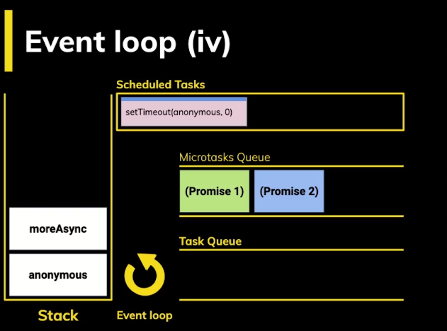
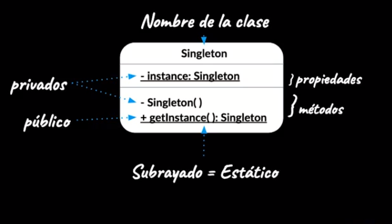

# JavaScript Professional

## Event loop

## Patrones de diseño

### Patrones creacionales

Proveen diferentes formas de crear objetos.

* Abstract Factory
* Builder -> Crea varios objetos a través de un objeto fuente
* Factory Method
* Prototype
* Singleton

#### Singleton

Es un patrón que te asegura que una claso solon tiene una instancia.  
Esta única instancia puede ser consumida por cualquier otro objeto.  
Estructura:

> Ej: Se utiliza para instanciar bases de datos

### Patrones estructurales

Describen formas de componer objetos para formar nuevas estructuras flexibles y eficientes.

* adapter
* Bridge
* Composite
* Decorator
* Façade
* Flyweight
* Proxy

### Patrones de comportamiento

Gestionan algoritmos y responsabilidades entre objetos

* Chain of resposibility
* Command
* Interpreter
* Iterator
* Mediator
* Memento
* Observer
* State
* Strategy
* Template Method
* Visitor
