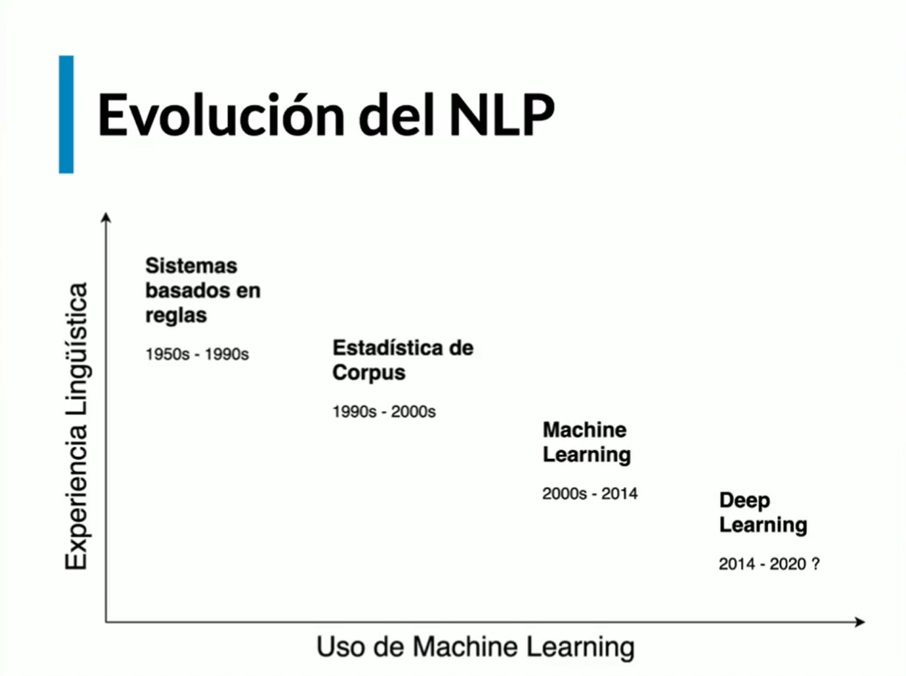
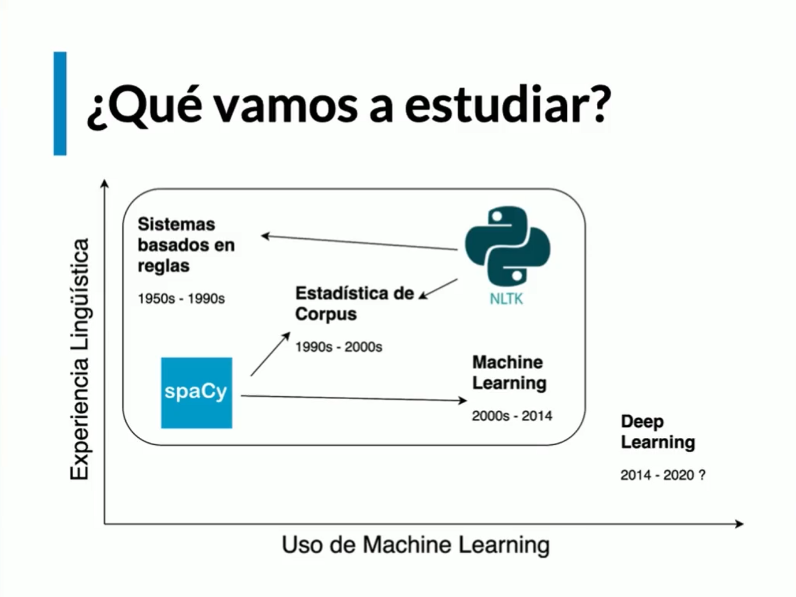

# Introducción a NLP (Natural Language Processing) 

## Prueba de Turing

> La prueba de Turing es un test propuesto por Alan Turing en 1950 para determinar si una máquina puede exhibir un comportamiento inteligente indistinguible del de un ser humano. En este test, un evaluador humano interactúa con una máquina y un humano a través de una interfaz de texto, sin saber cuál es cuál. Si el evaluador no puede distinguir entre la máquina y el humano, se considera que la máquina ha pasado la prueba.

## NLP Vs. NLU (Natural Language Understanding)

- NLP (Natural Language Processing) se refiere al campo de la inteligencia artificial que se ocupa de la interacción entre las computadoras y el lenguaje humano. Incluye tareas como el análisis de texto, la traducción automática, la generación de lenguaje natural y más.
- NLU (Natural Language Understanding) es una subárea de NLP que se centra en la comprensión del significado del lenguaje humano. NLU implica la interpretación del contexto, la identificación de intenciones y la extracción de entidades, entre otras tareas. En resumen, NLU es una parte fundamental de NLP que se centra en comprender el lenguaje humano en lugar de solo procesarlo.

## Usos actuales del NLP

- Máquinas de búsqueda
- Traductores de texto
- Chatbots
- Análisis de discurso
- Reconocimiento de voz
- Etc.

## Evolución de NLP

## Avances del NLP

- Enendrimiento de texto (bajo nivel)
  - Morfológica
  - Sintáctica
  - Semántica
- Aprendizaje de representaciones (alto nivel)
  - Word2Vec
  - Frase2Vec
  - FastText
  - GloVe
  - BERT
  - GPT-3
  - Etc.

## ¿Qué vamos a estudiar?

## Roadmap

1. Fundamentos de NLP
2. Aplicaciones de NLP
3. NLP en la industria
4. NLP Avanzado

## Lingüística computacional

El lenguaje se encuentra entre medio del NLP y la LC que son áreas de estudio que se ocupan de la interacción entre el lenguaje humano y las computadoras. ¿Qué hacen?

1. El NLP: ¿Qué y Cómo Computan las máquinas? - Ingeniería
  - Se ocupa de la interacción entre las computadoras y el lenguaje humano.
  - Incluye tareas como el análisis de texto, la traducción automática, la generación de lenguaje natural y más.
  - Se basa en técnicas de aprendizaje automático y procesamiento del lenguaje natural para analizar y comprender el lenguaje humano.
2. La LC: ¿Qué y Cómo Computan las personas? - Ciencia
  - Se ocupa del estudio de los lenguajes naturales y su representación computacional.
  - Incluye el estudio de la gramática, la semántica, la fonética y la morfología, entre otros aspectos del lenguaje.
  - Se basa en teorías lingüísticas y modelos formales para representar y analizar el lenguaje humano.

## Normalización de texto

Este va a ser el pipeline básico que vamos a seguir para normalizar el texto, que es un estándar actualmente en NLP. Este pipeline se puede dividir en 3 partes:
1. Tokenización 
  - Separar el texto en palabras o tokens.  
  - Ejemplo: "Hola, ¿cómo estás?" se convierte en ["Hola", "¿cómo", "estás", "?"].
2. Lematización
  - Reducir las palabras a su forma base o lema.
  - Ejemplo: "corriendo" se convierte en "correr".
3. Segmentación
  - Dividir el texto en oraciones o párrafos.
  - Ejemplo: "Hola. ¿Cómo estás?" se convierte en ["Hola.", "¿Cómo estás?"].

## Conceptos clave

- **Corpus**: Conjunto de textos utilizados para entrenar modelos de NLP.
- **Corpora**: Conjunto de conjuntos de textos.

## N-grams

Los N-gramas son secuencias de N elementos consecutivos de un texto. Se utilizan para analizar la frecuencia de palabras o frases en un corpus. Los N-gramas pueden ser unigrama (1 palabra), bigrama (2 palabras), trigramas (3 palabras), etc.

- **Unigrama**: "Hola"
- **Bigrama**: "Hola mundo"
- **Trigrama**: "Hola mundo cruel"
- ...

## Colocaciones

Las colocaciones son combinaciones de palabras que aparecen juntas con frecuencia en un corpus. Estas combinaciones pueden ser adjetivos y sustantivos, verbos y sustantivos, etc. Las colocaciones son importantes para entender el significado del lenguaje natural y se utilizan en tareas como la traducción automática y la generación de lenguaje natural.
- Ejemplo: "hacer una pregunta" es una colocación común en español.

## Recursos Léxicos

Un recurso léxico es una colección de palabras o frases que puede o no contener metadatos o información de cada uno de los elementos de esa colección. 

### ¿Por qué son importantes?

- Proporcionan información sobre el significado y uso de las palabras.
- Ayudan a mejorar la precisión de los modelos de NLP.
- Facilitan la creación de aplicaciones de NLP al proporcionar datos estructurados.

Se utilizan cuando una palabra tiene más de un significado o cuando una palabra tiene un significado diferente en diferentes contextos.
Ejemplo: 

- "Calle" [Verbo] -> Le puedes decir que se calle o me va a enloquecer...
- "Calle" [Sustantivo] -> Ten cuidado al cruzar la calle porque el semáforo no funciona...

Recursos léxicos utilizados:

| Entrada léxica | Categoría | Significado |
|----------------|-----------|-------------|
| Calle | Verbo | Conjugación del verbo "callar" en español. |
| Calle | Sustantivo | Referencia al espacio público por donde hay tránsito |

## WordNet

### Synsets

Un synset es un conjunto de sinónimos que representan un único concepto. Cada synset tiene un identificador único y puede contener múltiples palabras o frases que tienen el mismo significado. Los synsets se utilizan para organizar y clasificar el vocabulario de un idioma, facilitando la búsqueda y recuperación de información relacionada con un concepto específico.
- Ejemplo: El synset "perro" puede incluir palabras como "canino", "perrito" y "perra", todas relacionadas con el concepto de un perro.

### Jerarquía de synsets

- Hiperónimo: Palabra que tiene un significado más general que otra palabra. Por ejemplo, "animal" es un hiperónimo de "perro".
- Hipónimo: Palabra que tiene un significado más específico que otra palabra. Por ejemplo, "perro" es un hipónimo de "animal".