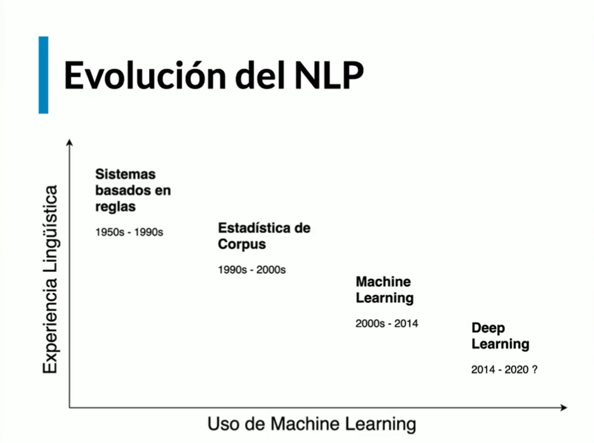
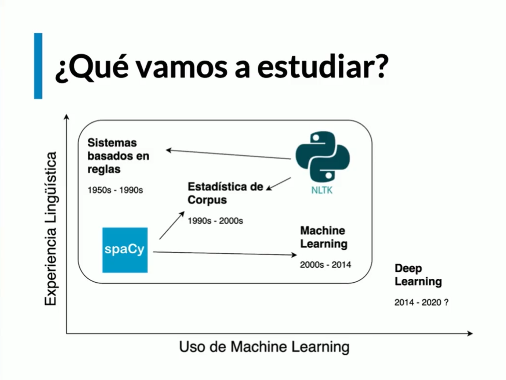

# Introducción a NLP (Natural Language Processing) 

## Prueba de Turing

> La prueba de Turing es un test propuesto por Alan Turing en 1950 para determinar si una máquina puede exhibir un comportamiento inteligente indistinguible del de un ser humano. En este test, un evaluador humano interactúa con una máquina y un humano a través de una interfaz de texto, sin saber cuál es cuál. Si el evaluador no puede distinguir entre la máquina y el humano, se considera que la máquina ha pasado la prueba.

## NLP Vs. NLU (Natural Language Understanding)

- NLP (Natural Language Processing) se refiere al campo de la inteligencia artificial que se ocupa de la interacción entre las computadoras y el lenguaje humano. Incluye tareas como el análisis de texto, la traducción automática, la generación de lenguaje natural y más.
- NLU (Natural Language Understanding) es una subárea de NLP que se centra en la comprensión del significado del lenguaje humano. NLU implica la interpretación del contexto, la identificación de intenciones y la extracción de entidades, entre otras tareas. En resumen, NLU es una parte fundamental de NLP que se centra en comprender el lenguaje humano en lugar de solo procesarlo.

## Usos actuales del NLP

- Máquinas de búsqueda
- Traductores de texto
- Chatbots
- Análisis de discurso
- Reconocimiento de voz
- Etc.

## Evolución de NLP

## Avances del NLP

- Enendrimiento de texto (bajo nivel)
  - Morfológica
  - Sintáctica
  - Semántica
- Aprendizaje de representaciones (alto nivel)
  - Word2Vec
  - Frase2Vec
  - FastText
  - GloVe
  - BERT
  - GPT-3
  - Etc.

## ¿Qué vamos a estudiar?

## Roadmap

1. Fundamentos de NLP
2. Aplicaciones de NLP
3. NLP en la industria
4. NLP Avanzado

