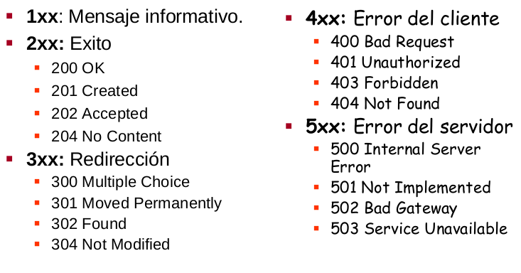

# Curso de Introducción al Desarrollo Backend

## Libreria

Solo aborda una utilidad especifica, pudiendo agregar más de una en tu proyecto. Eso si, asegurate que no interfieran con el código de otra librería.

## Framework

Conjunto de librerias, reglas y estándares para construir un producto digital.

## ¿Cómo conectar frontend con backend?

Se utiliza una API. Se requiere:

* SOAP(XML, obsoleto)
* REST(JSON, utilizado)

## HTTP

Hypertest Transfer Protocol

* Cliente -> Dispositivo que tenemos a la mano.
* Servidor -> Máquina siempre encendida que devuelve información que se solicita.

## Flujo de desarrollo (Deploy)

Entorno local -> push -> GitHub -> CI/CD -> Servidor

> Cuando el proyecto ya está en el servidor se dice que el proyecto ya está en producción

LocalHost = IP + Port, Ej: 127.0.0.1 : 8000

## Servidor

Hogar de tu código

### IaaS: Infrastructure as a service

AWS
Microsoft Azure
Digital Ocean

> Shared hosting es más barato y VPS(Virtual Private Server) más caro

### PaaS: Platform as a service

Firebase
Heroku
Google App Engine

### SaaS: Software as a service

Slack
Workdpress
Google Docs

## CRUD

Create Read Update Delete

Ejemplo: Usando <https://twitter.com/api/tweets>
-> Endpoint/route/path

### Tweets

* /post -> publish a tweet
* /tweets -> show all Tweets
* /tweets/{tweet_id} -> show a tweet
* /tweets/{tweet_id}/update -> update a tweet
* /tweets/{tweet_id}/delete -> delete a tweet

### Users

* /signup -> register a user
* /users -> show all users
* /users/{user_id} -> show a user
* /users/{user_id}/update -> update a user
* /users/{user_id}/delete -> delete a user

## Frameworks para Python

FastApi
Django → REST
Flask

>El lugar al que las APIs envían las peticiones y donde vive el recurso, se llama endpoint: Endpoint / Route / Path
