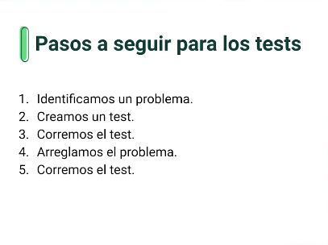

# Django

## Para iniciar un proyecto de Django

~~~bash
django-admin startproject __project_name__
~~~

## Iniciar servidor local de Django

~~~bash
python manage.py runserver
# If you want to run server over wifi
python manage.py runserver __machine_ip__

~~~

## Crear una app de Django

~~~bash
python manage.py startapp __app_name__
~~~

## Describir las tablas de la base de datos

~~~bash
python manage.py makemigrations __app_name__
~~~

## Migrar SQL para la tabla de la base de datos

~~~bash
python manage.py migrate
~~~

## Ejemplos desde los modelos

### Crear una pregunta

~~~python
>>> import datetime
>>> from django.utils import timezone
>>> from polls.models import Question
>>> q = Question(question_text="¿Quién es el mejor Course Director de Platzi?", pub_date=timezone.now() + datetime.timedelta(days=30)) # Esta pregunta se crea con la fecha 30 días en el futuro
~~~

## Testing

