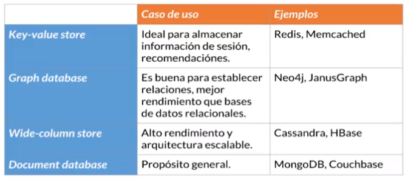

# MongoDB

## Bases de datos no SQL

* Key Values Stores
* Graph databases
* Wide-column stores
* Document databases

## Qué es MongoDB

* Base de datos no relacional
* Basada en documentos
* Se pueden guardar estructuras tipo _JSON_ (BSON)
* Base de datos distribuida (facilmente escalable)
* Codigo abierto
* Gratis

## MongoDB Atlas

* Aprovisionamiento automático de clusters con MongoDB
* Alta disponibilidad
* Altamente escalable
* Seguro
* Disponible con AWS, GCP y Azure
* Fácil monitoreo y optimización
