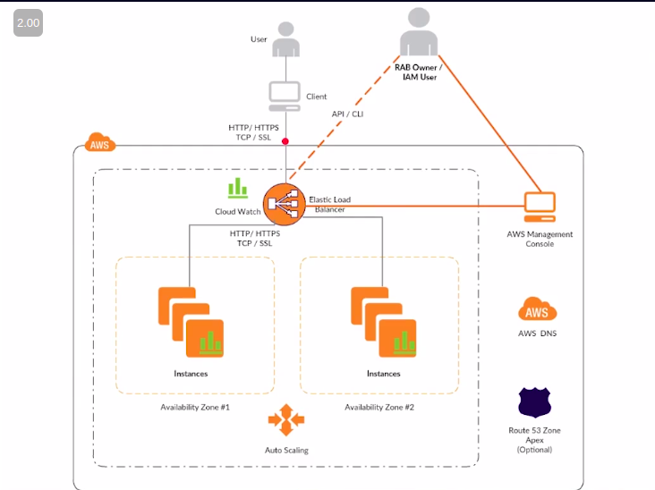

# AWS Fundamentals

## ¿Qué es?

* Computo en la nube para sitios web
* Respaldos y recuperación
* Archivos permanentes
* DevOps
* Analisis masivo
* Computo serverless (microservicios)
* Computo de alto rendimiento
* IoT
* Aplicaciones empresariales
* Distribución de media
* Servicios móviles
* Computo científico
* E-commerce
* Ambientes híbridos
* Blockchain

## Ventajas

* Cero inversión inicial (primer año gratis) "Usar amazon grant para estudiantes"
* Usa lo que necesites, apaga lo que no
* Crece tanto como sueñes
* Velocidad cuando la necesites
* Si no usas, no lo pagas
* Cobertura mundial

## Diagrama de funcionamiento

## Calculadora de precios

[Calculadora de precios](https://calculator.s3.amazonaws.com/index.html)