# Bases de datos

## Tipos

### Relacionales

* SQL Server
* Maria DB
* Oracle
* PostgreSQL
* MySQL

### No Relacionales

* Cassandra
* DynamoDB
* ElasticSearch
* MongoDB
* Neo4J
* etc

## Servicios

### Auto administrados

* Propias

### Administrados

* Amazon
* Google
* Azure

## Notas

* Se utiliza algebra relacional en rdb
* No utilizar correo como ID

## Relaciones

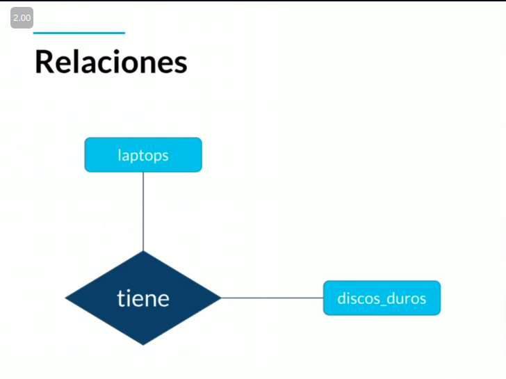

## Cardinalidad

### Cardinalidad 1:1

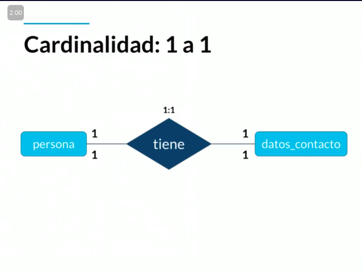

> Solo se tiene un registro a un lado y al otro, se utiliza +--------+ o ++-------++

### Cardinalidad 1:0

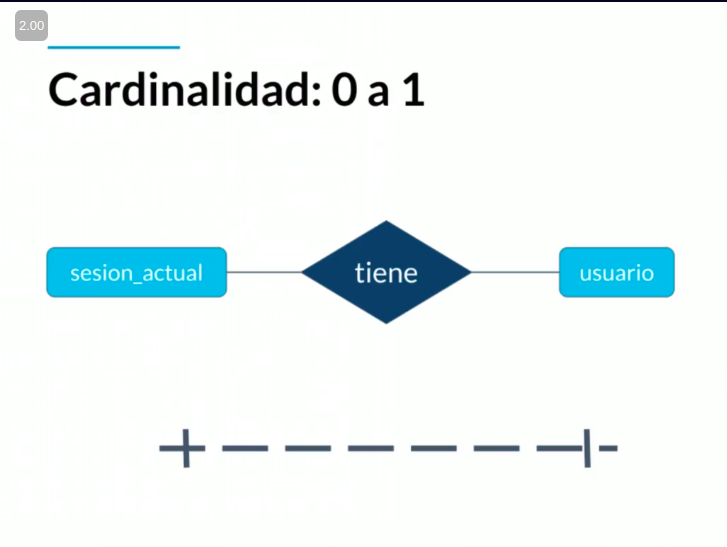

> Quiere decir que uno de los campos puede ser opcional, se utiliza +- - - - - - - - -+

### Cardinalidad 1:N

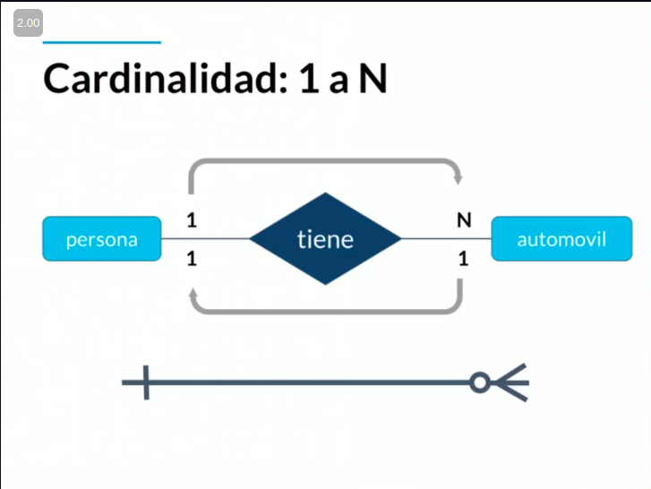

> Quiere decir que uno de los campos está relacionado con varios campos, se utiliza +-------o<-

### Cardinalidad 0:N

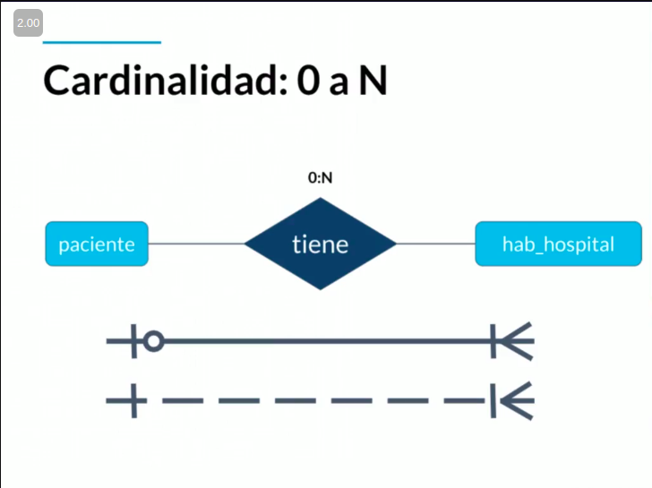

> Quiere decir que uno de los campos está relacionado con varios campos de manera opcional, se utiliza +- - - - - - -o<-

### cardinalidad N:N

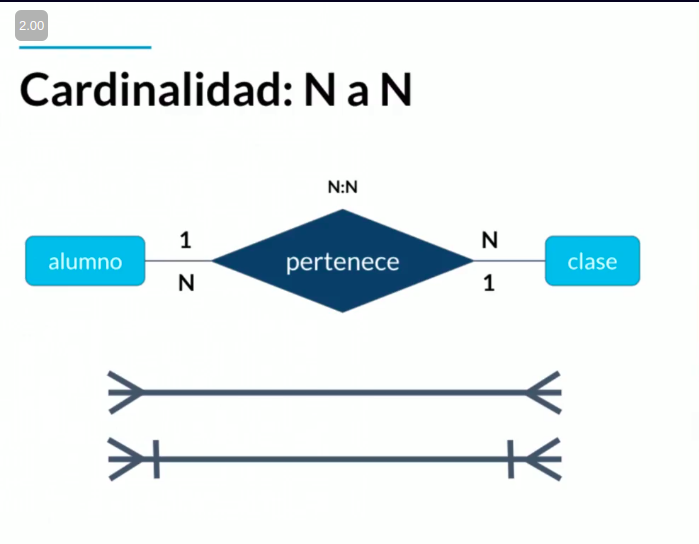

> Quiere decir que varios elementos de un lado pueden estar relacionados con uno del otro y viceversa, se utiliza ->o-------o<-

## Ejemplo de diagrama ER

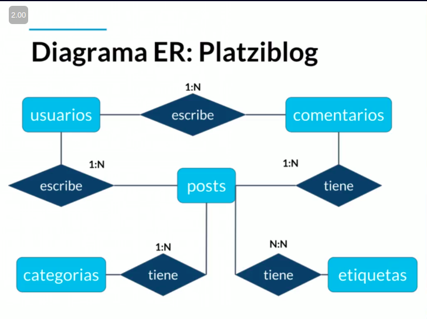

## Tipos de datos

|Texto      |Números        |Fecha/Hora     |Lógicos|
|:---------:|:-------------:|:-------------:|:-----:|
|CHAR(n)    |INTEGER        |DATE           |BOOLEAN|
|VARCHAR(n) |BIGINT         |TIME           |       |
|TEXT       |SMALLINT       |DATETIME       |       |
|           |DECIMAL(n,s)   |TIMESTAMP      |       |
|           |NUMERIC(n,s)   |               |       |

## Constraints

|Constraint             |Descripción                                                                        |
|-----------------------|-----------------------------------------------------------------------------------|
|NOT NULL               |Se asegura que la columna no tenga valores nulos                                   |
|UNIQUE                 |Se asegura que cada valor en la columna no se repita                               |
|PRIMARY KEY            |Es una combinación de NOT NULL y UNIQUE                                            |
|FOREIGN KEY            |Identifica de manera única una tupla en otra tabla                                 |
|CHECK                  |Se asegura que el valr en la columna cumpla una condición dada                     |
|DEFAULT                |Cuando un valor por defecto cuando no hay un valor especificado                    |
|INDEX                  |Se crea por columna para permitir búsquedas más rápidas                            |

## Normalización

Pasar de un punto incial

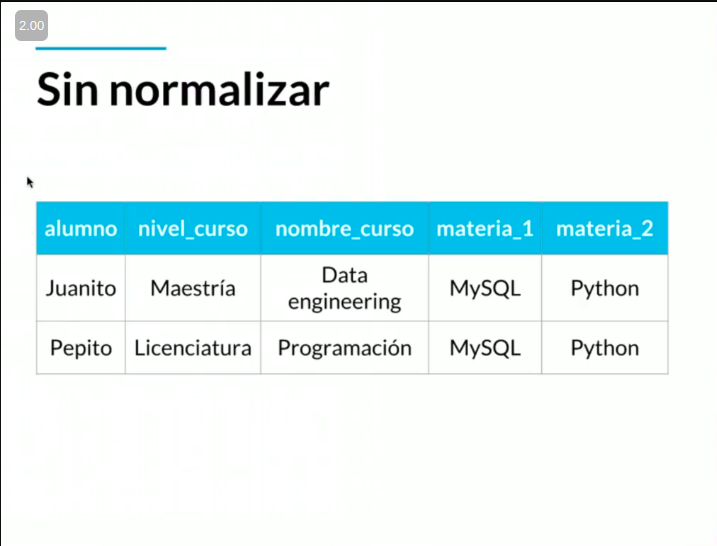

A un punto final con los datos mejor organizados

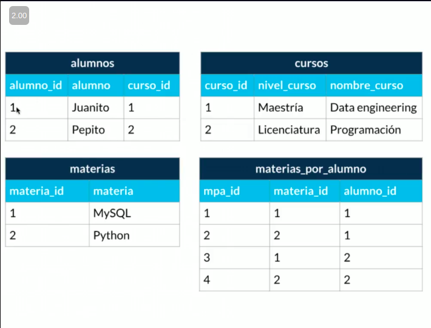

> Nos permite flexibilidad y evita datos repetidos
> Existen 5 formas de normalización

## Diagrama real de base de datos

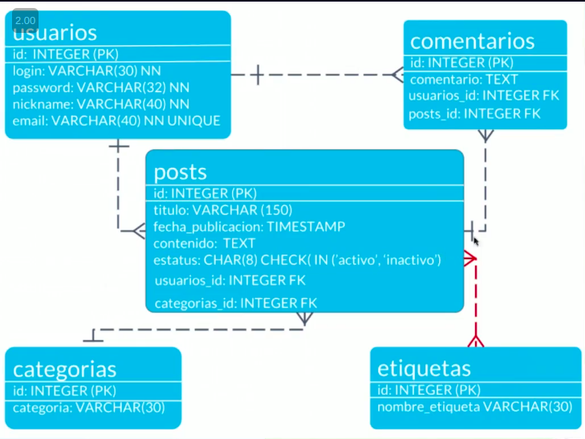

* Iniciamos por los que no tienen llaves foráneas
* Seguimos con las llaves foráneas
* Finalizamos con las de relación N:N

## RDBMS

Relational Database Manager System

* Oracle
* **MySQL**
* PostgreSQL

## DDL

Data Definition Language  
Se puede realizar:

* Create
* Alter
* Drop
* Use

Se pueden modificar:

* Databases
* Tables
* Views

Códigos de ejemplo:

~~~SQL
CREATE SCHEMA `new_schema`;
CREATE TABLE `new_schema`.`new_table` (
  `attr` INT NOT NULL,
  `attr2` VARCHAR(45) NULL,
 PRIMARY KEY (`attr`));

ALTER TABLE `new_schema`.`new_table` 
CHANGE COLUMN `old_attr_name` `old_attr_name` _CONSTRAINTS_ ;
ALTER TABLE `new_schema`.`old_table_name` 
RENAME TO  `new_schema`.`new_table_name` ;

DROP SCHEMA `platziblog`;
DROP TABLE `platziblog`.`people`;

USE 'schema_name';
~~~

## DML

Data Manipulation Language
Se puede realizar:

* Insert
* Update
* Delete
* Select

Se pueden modificar:

* Data

Códigos de ejemplo:

~~~SQL
INSERT INTO table_name (column_names)
VALUES(_values_),(_values_);

UPDATE table_name 
SET column_1 = '_new_value', column_2 = '_new_value' 
WHERE column_name = 'value'; -- This sentence could be optional if you are not scared to dead

DELETE FROM table_name
WHERE column_name = 'value'; -- This sentence could be optional if you are not scared to dead

SELECT column_1, column_2 AS _name_
FROM table_name
WHERE column_name = 'value' -- This sentence could be optional
GROUP BY column_1 -- This sentence could be optional
ORDER BY _name_ DESC-- This sentence could be optional
HAVING _name_ >= 2;-- This sentence could be optional
~~~

## FROM

## Summary

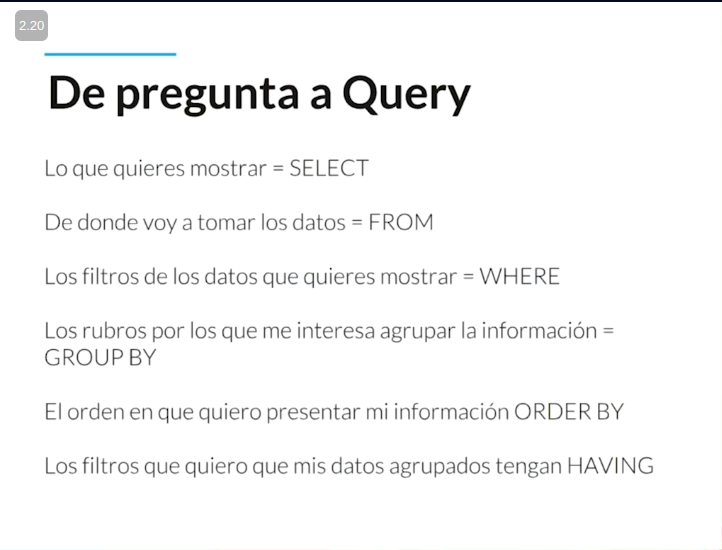