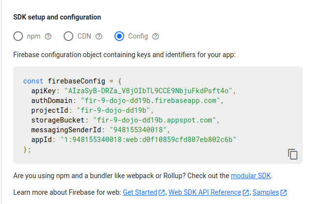

# Getting Started with Firebase 9

## Setup WebPack

~~~bash
npm init -y
npm i webpack webpack-cli -D
~~~

## Setup firebase

1. Create a proyect
2. Select web app
3. Open web app configuration
4. Copy config into index.js

5. Install firebase

~~~bash
npm install firebase
~~~

6. import necessary functions. Example: initializeApp
